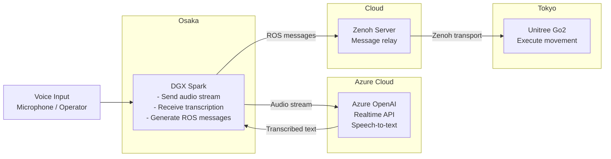

# Voice Control Architecture

## Summary

- Accept voice input on a DGX Spark located in Osaka.
- Stream audio to Azure OpenAI Realtime API for speech-to-text.
- Use the transcription result on the Osaka DGX Spark to generate ROS messages.
- Relay the ROS messages through a cloud-hosted Zenoh server.
- Deliver the command stream to a Unitree Go2 in Tokyo and execute movement.

## Mermaid

## Notes

- Speech recognition is handled remotely by Azure OpenAI Realtime API.
- Intent interpretation and ROS message generation stay on the Osaka DGX Spark.
- Cross-region robot command delivery is handled through the cloud Zenoh server.
